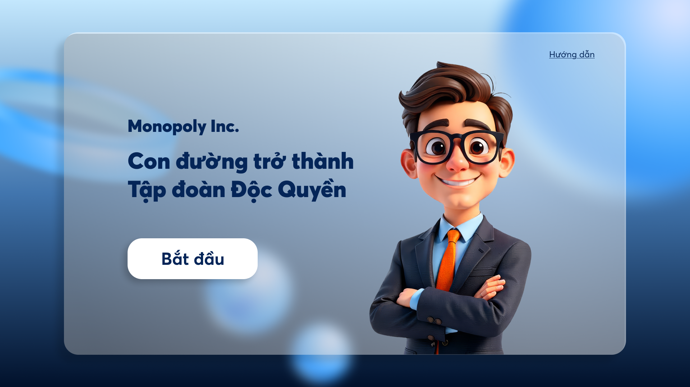
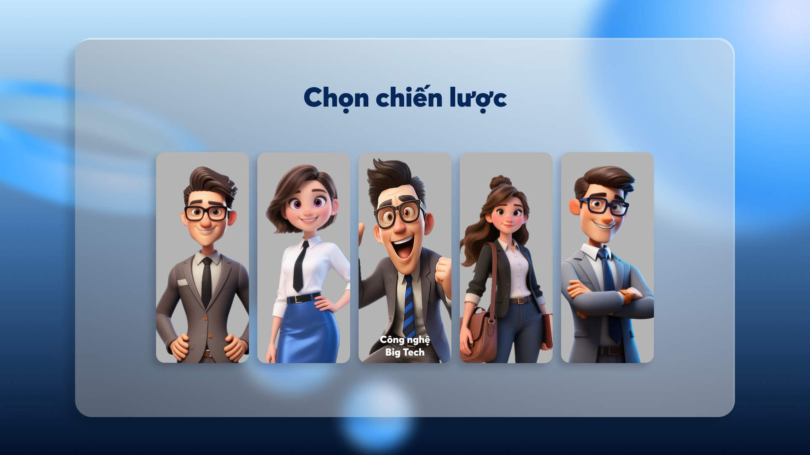
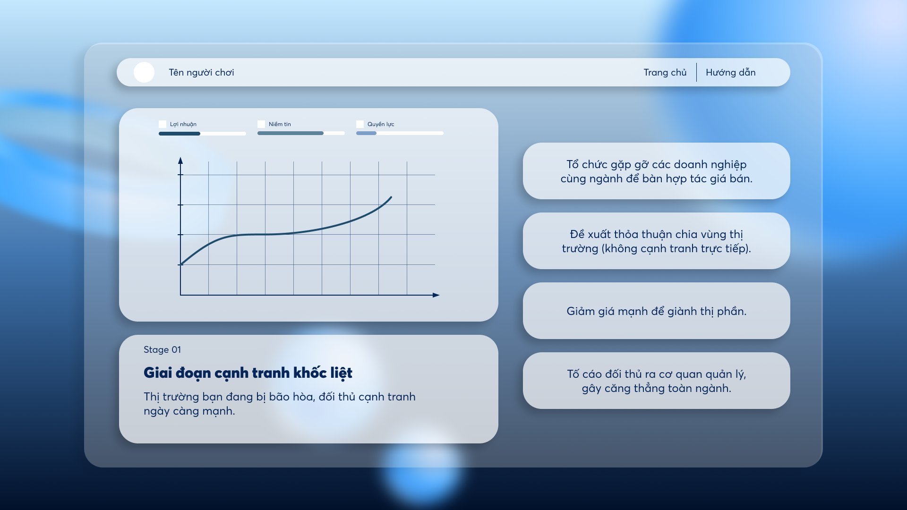

# MONOPOLY GENESIS

**Khởi Nguyên Độc Quyền** – Interactive Story Game

---

## Giới thiệu

Monopoly Genesis là một web–game tương tác dạng “story branching” cho phép người chơi nhập vai một nhà sáng lập doanh nghiệp – ra quyết định chiến lược – và dần chứng kiến sự vận động của tư bản từ cạnh tranh → tập trung → độc quyền → độc quyền nhà nước (theo tinh thần lý luận của V.I.Lênin trong chủ nghĩa đế quốc).

Mỗi lựa chọn mở ra một nhánh câu chuyện khác nhau, dẫn tới nhiều cái kết khác nhau.

---

## Tính năng nổi bật

- 5 ngành kinh tế khác nhau (Tech, Pharma, Steel, Diversified Conglomerate, Global Supply Chain…)
- Mỗi ngành có **prologue** (dẫn chuyện) với audio riêng
- **Typewriter Narration** + Skip
- Mỗi lựa chọn có **hiệu ứng lên 3 chỉ số**:
  - Profit (💰 Lợi nhuận)
  - Trust (🤝 Niềm tin xã hội)
  - Power (🏛️ Quyền lực chính trị)
- Nhiều **ending** khác nhau tùy chỉ số + flag
- Có “learn modal” → mỗi lựa chọn đều có thể mở 1 ghi chú mini bài học MLN

---

## Preview

### Trang Chủ



### Chọn ngành nghề



### Lựa Chọn Nhập Vai



---

## Cốt lõi ý tưởng MLN

> “Cạnh tranh → tích tụ → tập trung → độc quyền → tư bản tài chính → xuất khẩu tư bản → phân chia thị trường và lãnh thổ → Chiến tranh giữa các đế quốc.”

Game mô phỏng đúng logic này thông qua hành vi kinh doanh và chính trị – nhưng ở dạng game nhập vai.

---

## Triết lý thiết kế

Game không đánh giá “đúng / sai”.
Game **để người chơi tự nghiệm ra**:

- khi lợi nhuận chạy bằng mọi giá → trust sẽ sụp
- khi quyền lực vượt tầm → pháp luật chỉ còn là công cụ của nhóm lợi ích
- độc quyền không chỉ là kinh tế, độc quyền **luôn kết thúc bằng chính trị**

**đây là điều mà MLN muốn người học nhìn thấy bằng cảm giác – không phải chỉ bằng chữ.**

---

## Tech Stack

- Next.js 14 (App Router)
- React Server Components
- Tailwind CSS
- JSON Story Engine tự build

Toàn bộ nội dung story nằm trong `/public/data/story_*.json`.

---

## Cấu trúc Story JSON

```json
{
  "schema_version": "1.1",
  "industry_id": "diversify",
  "initial_stats": { "profit": 35, "trust": 55, "power": 30 },
  "prologue": { "paragraphs": ["..."], "audio": ["data/audio/..."] },
  "stages": [...],
  "endings": [...]
}
```

---

## Copyright / Attribution

Nội dung câu chuyện và format engine thuộc về tác giả game.
Tư liệu lý luận dựa trên tinh thần các tác phẩm của V.I.Lênin về chủ nghĩa đế quốc.

---

## Status

> v0.1 – prototype
> Cập nhật thường xuyên theo tiến độ build.

---

## License

All rights reserved.
No part of this project may be reproduced, copied or modified without explicit permission from the author.
